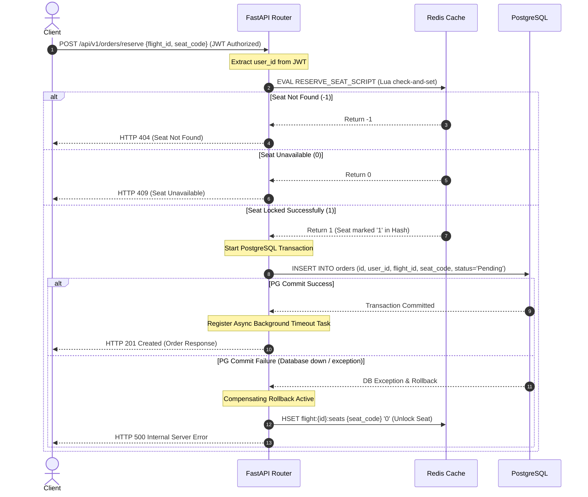
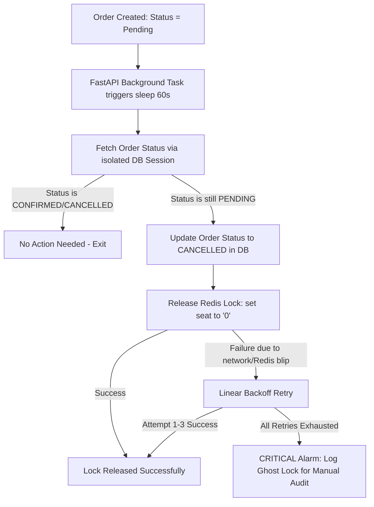

# High-Concurrency Flight Booking Backend Engine

A production-ready transatlantic flight search & seat booking backend engine. Engineered with **FastAPI**, **PostgreSQL**, and **Redis** to solve the dual challenges of high-concurrency seat reservation (overselling prevention) and low-latency cache queries, backed by a robust JWT authentication system.

---

## 🛠 Tech Stack

| Technology | Role |
| :--- | :--- |
| **FastAPI** | High-performance asynchronous Web framework (Python 3.12) |
| **PostgreSQL** | Primary relational DB for storing users, flight metadata, and orders |
| **Redis** | In-memory database used for atomic seat lock status and high-speed cache |
| **SQLAlchemy (Async)** | Async Object Relational Mapper for PG queries |
| **PyJWT & Bcrypt** | Security layer handling dual-token auth and password hashing |
| **Docker Compose** | Sandbox orchestration for local development and integration tests |

---

## 🏗 System Architecture & Critical Workflows

### 1. Atomic Seat Reservation (Lua Lock + PG Transaction)

To prevent overselling under high concurrency, seat status checks and locking are decoupled from the database and handled entirely in-memory using a **Redis Lua script**. If the database transaction fails to commit (e.g., due to connection drop or constraint violation), the engine triggers an automatic **Compensating Rollback** in Redis to release the seat.



### 2. Async Payment Timeout & Linear-Backoff Lock Release

Unpaid orders expire after **60 seconds**. A non-blocking asynchronous task monitors the order state. If it remains unpaid, it is cancelled in the database, and the seat is released in Redis using a retry mechanism with **linear backoff** to survive transient Redis disconnections.



---

## 🚀 Key Technical Highlights & Design Decisions

### 1. Zero Overselling via Redis Lua Script
* **The Problem:** In a high-concurrency booking event, standard database transactions (`SELECT ... FOR UPDATE`) lead to database lock contention, massive connection queues, and severe latency spikes. Using separate Redis `GET` and `SET` calls introduces race conditions.
* **The Solution:** We implement an in-memory atomic lock using a custom Redis Lua Script. The check-and-set logic runs in a single event-loop cycle in Redis:
  ```lua
  local status = redis.call('HGET', KEYS[1], ARGV[1])
  if status == false then return -1 end       -- Seat does not exist
  if status == '0' then 
      redis.call('HSET', KEYS[1], ARGV[1], '1') -- Lock the seat atomically
      return 1 
  else 
      return 0                                -- Already locked
  end
  ```
  This reduces lock contention latency to sub-millisecond levels.

### 2. Dual-Write Consistency & "Ghost Lock" Compensation
* **The Problem:** A classic distributed systems dilemma: Redis lock succeeds, but PostgreSQL write fails, leaving a "Ghost Lock" (seat is locked in Redis, but no order is created in Postgres, making the seat permanently unbookable).
* **The Solution:** The engine implements a compensating rollback strategy. The Postgres transaction write is wrapped in a `try...except` block. If DB insertion or commit fails, a rollback is executed on both PostgreSQL and Redis, ensuring eventual consistency.

### 3. Read Performance Optimization (Cache-Aside + Mitigations)
* **High-Speed Queries:** Flight search queries use the **Cache-Aside** pattern. The system queries Redis first, falling back to PostgreSQL only on a cache miss.
* **Cache Avalanche Mitigation:** To prevent thundering herds from database-hitting queries when multiple cache keys expire at the same time, we inject a **randomized TTL Jitter** ($\pm 300\text{s}$) on top of the base 30-minute expiration.
* **Cache Penetration Mitigation:** High-frequency queries for non-existent routes (e.g. malformed or invalid travel dates) bypass the DB after the first miss by caching the empty search results with a **short 60-second TTL**.

### 4. Enterprise Session Security (JWT Dual-Token with Active Revocation)
* **Access & Refresh Token Flow:** When a user logs in, the engine issues a short-lived **Access Token** (15 minutes) and a long-lived **Refresh Token** (7 days).
* **Stateful Active Revocation:** Although JWT is stateless, session invalidation (logout) is achieved by storing the Refresh Token in Redis. On `/auth/logout`, the token is immediately removed from Redis. During token refresh requests, the engine validates both the signature and its existence in Redis, neutralizing stolen refresh tokens immediately.

---

## 📂 Project Directory Structure

Here is a curated directory layout explaining the core logic files:

*   📂 **`flight_backend_project/`**
    *   📄 [main.py](file:///Users/brooks/github/flight_backend_project/main.py): FastAPI application initialization, exception handlers, and lifespan handlers.
    *   📄 [api.py](file:///Users/brooks/github/flight_backend_project/api.py): Flight search and seat reservation routes.
    *   📄 [auth_api.py](file:///Users/brooks/github/flight_backend_project/auth_api.py): User registration, login, logout, and token refresh endpoints.
    *   📄 [services.py](file:///Users/brooks/github/flight_backend_project/services.py): Central core service layer (Lua scripts execution, Cache-aside logic, compensating rollback, background timeout cancellation).
    *   📄 [models.py](file:///Users/brooks/github/flight_backend_project/models.py): SQLAlchemy models (users, flights, seats, orders) and Pydantic schemas.
    *   📄 [auth.py](file:///Users/brooks/github/flight_backend_project/auth.py): Password hashing (bcrypt) and JWT encode/decode helper functions.
    *   📄 [database.py](file:///Users/brooks/github/flight_backend_project/database.py): Asynchronous DB engines, session makers, Redis clients, and environment settings.
    *   📄 [seed.py](file:///Users/brooks/github/flight_backend_project/seed.py): Mock database seeder initializing flights and seats for test purposes.
    *   📄 [stress_test.py](file:///Users/brooks/github/flight_backend_project/stress_test.py): Concurrent request simulation verifying zero-overselling.
    *   📂 **`tests/`**
        *   📄 [test_auth.py](file:///Users/brooks/github/flight_backend_project/tests/test_auth.py): Integration tests validating user sign-up, dual-token generation, refresh, and logout.
        *   📄 [test_services.py](file:///Users/brooks/github/flight_backend_project/tests/test_services.py): Unit tests for flight queries, Lua locking mechanism, and timeout cancellations.

---

## 🚦 Core API Specifications

| Method | Endpoint | Description | Auth Required |
| :--- | :--- | :--- | :--- |
| **POST** | `/api/v1/auth/register` | Register a new user account | None |
| **POST** | `/api/v1/auth/login` | Authenticate and return Access + Refresh Token | None |
| **POST** | `/api/v1/auth/logout` | Revoke user session and delete Refresh Token from Redis | None |
| **POST** | `/api/v1/auth/refresh` | Reissue Access Token using a valid Refresh Token | None |
| **GET** | `/api/v1/flights` | Search flights (Utilizes Cache-Aside, return cache status header) | None |
| **POST** | `/api/v1/orders/reserve` | Reserve seat atomically (Returns order details, schedules timeout) | **JWT Access Token** |

---

## 🛠 Local Sandbox Setup

### Prerequisites
* Docker & Docker Compose
* Python 3.12+

### 1. Launch Core Services (PostgreSQL & Redis)
Spin up the database and cache in the background:
```bash
docker-compose up -d
```

### 2. Configure Environment Variables
Copy the template and adjust secrets if needed:
```bash
cp .env.example .env
```

### 3. Install Python Dependencies
Create a virtual environment and install backend requirements:
```bash
python3 -m venv venv
source venv/bin/activate
pip install -r requirements.txt
```

### 4. Seed Development Data & Run the Server
Seed 10,000+ mock flights, initialize seat grids in Redis, and spin up the development server:
```bash
python seed.py
uvicorn main:app --host 0.0.0.0 --port 8080 --reload
```
*   **Interactive API Docs**: `http://localhost:8080/docs`

### 5. Running Automated Test Suite
Exhaustive unit and integration tests covering the security layer and transaction rollbacks:
```bash
pytest -v
```

---

## 📈 Concurrency & Stress Testing (Benchmark)

To prove that the Lua engine guarantees **zero-overselling** under high concurrent pressure:

1. Running the custom stress test script:
   ```bash
   python stress_test.py
   ```
2. **What this script does:**
   - Registers a test user and logs in to retrieve a JWT Access Token.
   - Spawns **30 concurrent async workers** requesting the exact same seat code (`12A`) on flight `AA100` at the exact same millisecond.
3. **Expected Terminal Output:**
   ```text
   Starting stress test...
   [Worker 1] Status: 201 - Reservation Success (Order Created)
   [Worker 2] Status: 409 - Seat is already reserved or unavailable.
   [Worker 3] Status: 409 - Seat is already reserved or unavailable.
   ...
   [Worker 30] Status: 409 - Seat is already reserved or unavailable.
   
   Summary: 1 success, 29 failed (conflict). Overselling prevented successfully!
   ```
